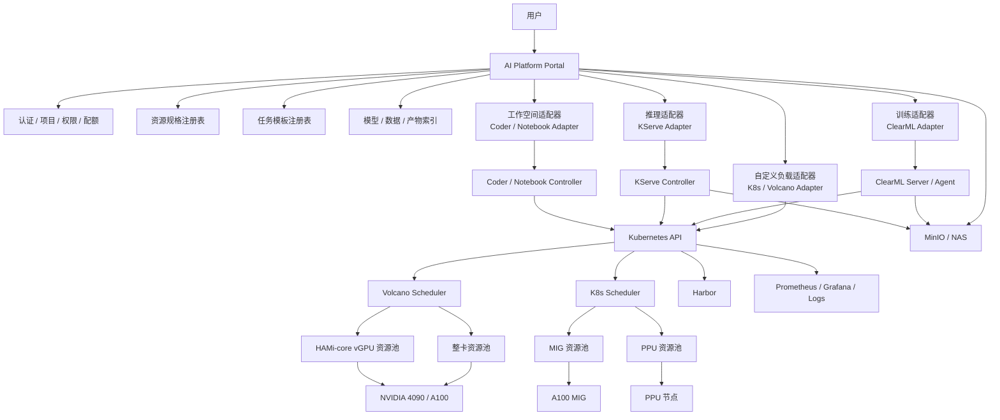
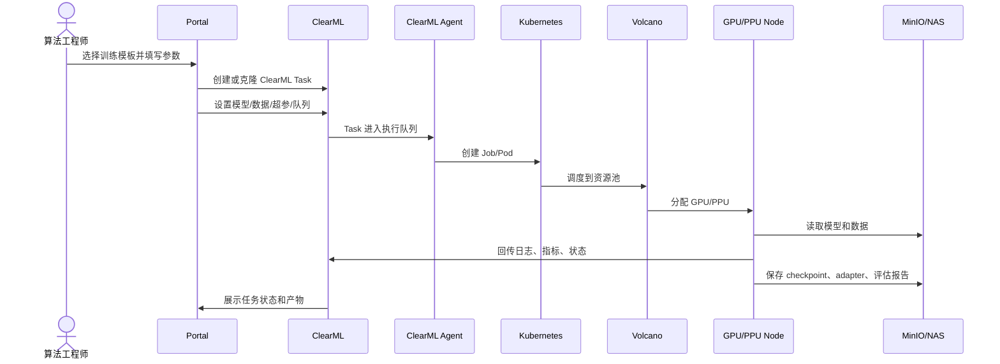
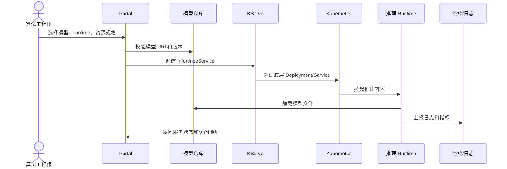
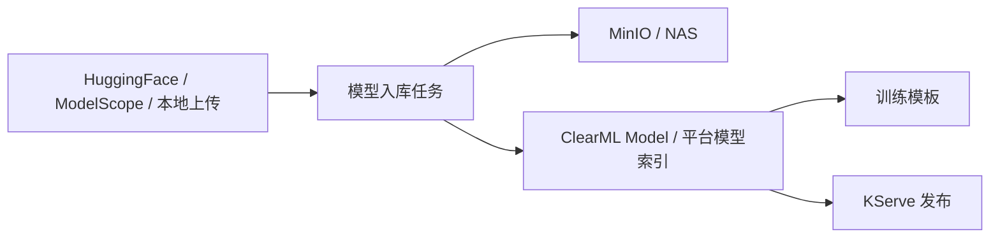

# 异构算力全自动 MLOps 平台技术设计方案

> 面向平台负责人和实施人员。本文承接《异构算力全自动 MLOps 平台建设方案（汇报版）》，展开组件边界、资源池设计、ClearML/KServe/K8s 集成方式、模型数据流和阶段性技术落地方案。  
> 调研基准时间：2026-07-01。

---

## 1. 技术目标与边界

### 1.1 技术目标

建设一套轻量 MLOps 平台，覆盖：

```text
训练任务
推理服务
自定义 K8s 负载
交互式工作空间
模型/数据/产物管理
异构 GPU/PPU 调度
日志、监控、审计
```

平台的核心思想是：Portal 统一入口，底层复用成熟开源组件。

```text
训练：ClearML
推理：KServe
自定义任务：K8s / Volcano
工作空间：Coder 或 Kubeflow Notebooks
调度：Kubernetes + Volcano
vGPU：volcano-vgpu-device-plugin / HAMi-core
整卡与 MIG：NVIDIA device plugin / GPU Operator
存储：MinIO / NAS
镜像：Harbor
监控：Prometheus / Grafana / 日志系统
```

### 1.2 关键边界

1. ClearML 只作为训练、实验追踪、任务模板、模型产物记录平台，不作为通用 K8s 平台。
2. KServe 只作为标准推理服务发布平台，不承担训练调度。
3. 自定义任务 Tab 直接封装 K8s/Volcano 基础能力，不默认接 ClearML Task。
4. 工作空间 Tab 只负责交互式开发环境，不承担长期推理服务。
5. Portal 不直接替代 ClearML/KServe/Coder，而是做统一入口、参数封装、权限和状态聚合。

---

## 2. 技术总体架构



---

## 3. 资源池与调度设计

### 3.1 资源池划分

建议按节点池隔离，不要在同一张卡上混用多套 device plugin 语义。

| 资源池 | 适合设备 | 插件/机制 | Kubernetes 资源语义 | 适用场景 |
|---|---|---|---|---|
| `4090-full` | 4090 | NVIDIA device plugin | `nvidia.com/gpu` | 整卡训练、较大模型微调 |
| `4090-hami` | 4090 | volcano-vgpu-device-plugin + HAMi-core | `volcano.sh/vgpu-*` | 小模型调试、轻量微调、量化测试 |
| `a100-full` | A100 | NVIDIA device plugin | `nvidia.com/gpu` | 大模型训练、多卡训练、高优任务 |
| `a100-mig` | A100 | NVIDIA device plugin MIG mixed | `nvidia.com/mig-*` | 硬隔离推理、小模型服务 |
| `a100-vgpu-mig` | A100 | volcano-vgpu-device-plugin dynamic MIG | `volcano.sh/vgpu-*` + mode `mig` | 需要 Volcano vGPU 体系管理的 MIG 场景 |
| `ppu` | PPU | 厂商 device plugin | 厂商资源名 | PPU 适配任务 |

### 3.2 重要修正：HAMi-core 资源语义

当前 `volcano-vgpu-device-plugin + HAMi-core` 路线下，**不使用**：

```yaml
nvidia.com/gpu: 1
```

而是使用：

```yaml
metadata:
  annotations:
    volcano.sh/vgpu-mode: "hami-core"
spec:
  schedulerName: volcano
  runtimeClassName: nvidia
  containers:
  - name: worker
    resources:
      limits:
        volcano.sh/vgpu-number: "1"
        volcano.sh/vgpu-memory: "24"
        volcano.sh/vgpu-cores: "100"
```

判断某个节点支持什么资源，不靠推测，直接看节点 allocatable：

```bash
kubectl describe node <node-name> | egrep 'nvidia.com/gpu|nvidia.com/mig|volcano.sh/vgpu'
```

### 3.3 MIG 资源语义

`nvidia.com/mig-1g.10gb: 1` 属于 NVIDIA device plugin / GPU Operator 的 MIG 语义，不属于 HAMi-core 语义。

只有节点实际暴露类似资源时才能使用：

```text
nvidia.com/mig-1g.10gb
nvidia.com/mig-2g.20gb
nvidia.com/mig-3g.40gb
```

示例：

```yaml
resources:
  limits:
    nvidia.com/mig-1g.10gb: 1
nodeSelector:
  gpu.pool: a100-mig
```

不同 A100 型号的 MIG profile 名称不同。A100 40GB 常见 profile 不是 `1g.10gb`，需要以实际节点暴露资源为准。

### 3.4 资源选择平台参数

Portal 不建议让算法同学填写底层资源名，而是暴露业务规格：

| 平台参数 | 说明 |
|---|---|
| `resource_mode` | `full_gpu` / `hami_vgpu` / `mig` / `ppu` |
| `gpu_type` | `4090` / `A100` / `PPU` |
| `gpu_count` | 整卡数量、MIG 实例数量或 vGPU 数量 |
| `vgpu_memory_gb` | HAMi-core vGPU 显存，按集群配置换算 |
| `vgpu_cores_percent` | HAMi-core vGPU 算力比例 |
| `mig_profile` | MIG profile，如 `1g.10gb` |
| `queue` | ClearML 队列或 Volcano 队列 |

映射示例：

```text
resource_mode=hami_vgpu, gpu_type=4090, gpu_count=1, memory=24, cores=100
=> volcano.sh/vgpu-number=1
=> volcano.sh/vgpu-memory=24
=> volcano.sh/vgpu-cores=100

resource_mode=mig, gpu_type=A100, profile=1g.10gb, count=1
=> nvidia.com/mig-1g.10gb=1

resource_mode=full_gpu, gpu_type=A100, count=1
=> nvidia.com/gpu=1
```

---

## 4. 训练 Tab 技术设计

### 4.1 ClearML 定位

ClearML 负责：

```text
实验追踪
训练任务管理
训练模板沉淀
参数记录
日志和指标记录
模型与产物记录
任务复现
```

不负责：

```text
通用 K8s 服务发布
长期在线推理服务治理
任意容器平台
```

### 4.2 开源 ClearML 推荐方式

开源 ClearML 下，建议优先采用“队列绑定资源模板”的方式，而不是让每个 Task 动态生成任意 Pod 资源。

示例队列：

| ClearML Queue | 资源池 | 用途 |
|---|---|---|
| `train-4090-full-1` | `4090-full` | 单卡训练、微调 |
| `train-a100-full-1` | `a100-full` | A100 单卡训练 |
| `train-a100-full-8` | `a100-full` | 多卡/分布式训练 |
| `dev-4090-vgpu-8g` | `4090-hami` | 小任务调试 |
| `dev-4090-vgpu-24g` | `4090-hami` | 4090 等价整卡显存任务 |
| `ppu-low` | `ppu` | PPU 适配任务 |

训练模板中记录资源参数，但实际调度以队列和 Agent Pod Template 为准。

### 4.3 当前 vGPU Hook 约定

在 `volcano-vgpu-device-plugin + HAMi-core` 场景，ClearML Task 可记录：

```python
task.connect(
    {
        "vgpu_number": 1,
        "vgpu_memory": 24,
        "vgpu_cores": 100,
    },
    name="VGPU",
)
```

平台 Agent Hook 读取 `VGPU` 段后注入：

```yaml
volcano.sh/vgpu-number
volcano.sh/vgpu-memory
volcano.sh/vgpu-cores
```

注意：这个约定只适用于当前自定义 vGPU Hook，不是 ClearML 官方通用资源语义。

### 4.4 训练模板分类

| 模板 | 说明 | 主要参数 |
|---|---|---|
| SFT / LoRA / QLoRA | 大模型微调 | base model、dataset、learning rate、epoch、adapter output |
| 量化 | GPTQ/AWQ/GGUF/其他 | input model、quant method、bits、output path |
| 蒸馏 | teacher/student 模型 | teacher model、student model、dataset、loss config |
| 剪枝 | 模型压缩 | input model、prune ratio、eval dataset |
| RLHF/RL | 强化学习 | policy model、reward model、rollout config |
| 评测 | 模型效果验证 | model path、benchmark、metrics |

### 4.5 训练业务流



---

## 5. 推理 Tab 技术设计

### 5.1 KServe 定位

KServe 负责标准推理服务生命周期：

```text
创建服务
更新服务
服务状态
访问地址
副本数
资源规格
日志和事件
灰度/回滚能力
```

KServe 不替代 vLLM/SGLang/TensorRT-LLM。推理引擎仍然由对应 runtime 镜像负责。

### 5.2 推理服务类型

| 类型 | Runtime | 适合场景 |
|---|---|---|
| OpenAI API 兼容 LLM | vLLM / SGLang | 通用大模型服务 |
| 高性能引擎 | TensorRT-LLM | 高吞吐、低延迟优化 |
| 多模型通用服务 | Triton | 传统模型、多框架 |
| 自定义推理 | 自定义 ServingRuntime | 特殊模型或业务逻辑 |

### 5.3 推理业务流



### 5.4 Portal 推理表单建议

```text
服务名称
模型 URI
模型版本
推理框架：vLLM / SGLang / TensorRT-LLM
镜像版本
GPU 规格
副本数
最大上下文长度
并发参数
环境变量
访问方式
```

---

## 6. 自定义任务 Tab 技术设计

### 6.1 定位

自定义任务 Tab 做基础 K8s 平台能力，不默认接 ClearML。

适用场景：

```text
临时数据处理
自定义镜像测试
模型转换
Benchmark
非标准服务
一次性脚本
临时调试任务
```

### 6.2 支持负载类型

| 类型 | 底层对象 | 优先级 |
|---|---|---|
| 一次性任务 | Job / VolcanoJob | P0 |
| 长期服务 | Deployment + Service | P1 |
| 定时任务 | CronJob | P2 |
| 批量任务 | VolcanoJob | P1 |

### 6.3 表单参数

```text
镜像
启动命令
参数
环境变量
资源规格
队列/优先级
PVC/NAS 挂载
Secret
日志查看
停止/删除/重跑
进入容器调试
```

### 6.4 安全边界

1. 镜像来源限制在 Harbor 白名单。
2. 禁止默认 privileged。
3. 限制 hostPath，仅允许平台批准路径。
4. 默认开启资源 requests/limits。
5. 任务命名空间按项目或团队隔离。
6. 操作行为写入审计日志。

---

## 7. 工作空间 Tab 技术设计

### 7.1 选型建议

| 方案 | 优点 | 缺点 | 建议 |
|---|---|---|---|
| Coder | VS Code 体验好，适合远程开发 | 需要设计模板和权限 | 推荐优先评估 |
| Kubeflow Notebooks | AI 场景成熟，Jupyter 友好 | Kubeflow 体系偏重 | 可作为 Notebook 入口 |
| OpenDataHub Dashboard | Portal 能力完整 | 需要二次开发理解成本 | 可参考，不建议直接全量引入 |

### 7.2 功能范围

```text
创建工作空间
选择镜像
选择 CPU/GPU/内存
挂载个人 PVC / 项目 NAS
打开 VS Code / JupyterLab / Terminal
空闲回收
日志和事件
删除工作空间
```

---

## 8. 模型、数据与产物管理

### 8.1 存储分层

| 类型 | 推荐位置 | 说明 |
|---|---|---|
| 原始数据 | NAS / MinIO | 数据源归档 |
| 版本化数据集 | ClearML Dataset + MinIO | 训练可复现 |
| 基座模型 | NAS / MinIO | 统一下载和缓存 |
| 训练 checkpoint | NAS / MinIO | 中间产物 |
| adapter / merged model | NAS / MinIO + ClearML Model | 可发布模型 |
| 量化模型 / engine | NAS / MinIO + ClearML Model | 推理部署输入 |
| 评估报告 | ClearML Artifact / MinIO | 结果审计 |

### 8.2 模型入库流程



### 8.3 训练脚本路径约定

训练脚本内部最终应拿到本地可读路径。平台支持用户填写：

```text
s3://bucket/models/qwen/
minio://models/qwen/
/mnt/nas/models/qwen/
clearml-model://<model-id>
```

由模板或平台工具解析到容器内本地路径，例如：

```text
/models/qwen/
/mnt/nas/models/qwen/
/root/.cache/models/qwen/
```

---

## 9. Portal 后端模块设计

### 9.1 核心模块

| 模块 | 职责 |
|---|---|
| Auth / Project | 用户、项目、角色、权限 |
| Resource Profile | 资源规格注册表，屏蔽底层 K8s 资源名 |
| Template Registry | 训练模板、推理模板、自定义任务模板 |
| ClearML Adapter | 创建/克隆 Task，设置参数，查询状态 |
| KServe Adapter | 创建/更新/删除 InferenceService |
| K8s Adapter | 创建 Job/VolcanoJob/Deployment，查询日志 |
| Workspace Adapter | 对接 Coder 或 Notebook |
| Storage Adapter | 模型、数据、产物路径管理 |
| Audit / Event | 操作审计、事件记录 |

### 9.2 Resource Profile 示例

```yaml
name: dev-4090-vgpu-24g
mode: hami_vgpu
nodeSelector:
  gpu.pool: 4090-hami
schedulerName: volcano
runtimeClassName: nvidia
resources:
  limits:
    volcano.sh/vgpu-number: "1"
    volcano.sh/vgpu-memory: "24"
    volcano.sh/vgpu-cores: "100"
```

```yaml
name: a100-mig-1g10gb
mode: mig
nodeSelector:
  gpu.pool: a100-mig
resources:
  limits:
    nvidia.com/mig-1g.10gb: "1"
```

---

## 10. 阶段性实施计划

### 10.1 基础设施机器规划

GPU/PPU 节点主要承载训练、推理和自定义任务。Kubernetes 控制面、Harbor、ClearML、Portal、Prometheus、Grafana、日志系统等基础服务建议使用非 GPU 节点承载，避免平台服务和训练任务互相影响。

#### 10.1.1 MVP 最低可用拓扑

适合先快速跑通训练平台。

| 节点 | 数量 | 配置建议 | 承载组件 |
|---|---:|---|---|
| `mgmt-1..3` | 3 | 16C / 64GB / 1-2TB NVMe / 10GbE | K8s control plane、etcd、Volcano、ClearML、Portal、Harbor、Prometheus、Grafana、日志组件 |
| `gpu-worker-*` | 现有 | 现有 4090 / A100 / PPU 节点 | 训练、推理、自定义任务、工作空间 |
| `storage` | 1 套 | NAS 或 MinIO，20-50TB 可用容量起步 | 模型、数据、checkpoint、产物 |

MVP 可以接受基础服务混部，但应通过 node label 和 taint 控制普通训练任务不调度到管理节点。

建议标签：

```yaml
node-role.platform/control-plane: "true"
node-role.platform/infra: "true"
gpu.pool: "4090-hami"
gpu.pool: "a100-full"
gpu.pool: "a100-mig"
gpu.pool: "ppu"
```

#### 10.1.2 推荐生产拓扑

适合正式给算法团队长期使用。

| 节点 | 数量 | 配置建议 | 承载组件 |
|---|---:|---|---|
| `master-1..3` | 3 | 8-16C / 32-64GB / 500GB-1TB 企业级 SSD | Kubernetes API Server、etcd、controller-manager、scheduler |
| `infra-1..2` | 2 | 16-32C / 64-128GB / 2-4TB NVMe | ClearML、Portal、Harbor、Prometheus、Grafana、日志、KServe 控制组件 |
| `gpu-worker-*` | 现有 | 现有 GPU/PPU 机器 | 训练、推理、工作空间、自定义任务 |
| `storage` | 1 套 | NAS 或分布式 MinIO，50TB+ 可用容量 | 模型、数据、checkpoint、adapter、量化产物、评估报告 |

生产环境建议最少准备：

```text
3 台控制面节点
2 台平台基础服务节点
1 套共享存储
现有 GPU/PPU 节点作为 Worker
```

#### 10.1.3 20+ GPU 机器扩容拓扑

| 类型 | 建议 |
|---|---|
| 控制面 | 仍保持 3 台，建议 16C / 64GB / 1TB SSD |
| 平台服务 | 扩到 3 台以上，建议 32C / 128GB / 4TB NVMe |
| 存储 | 100TB+ 可用容量，按模型、数据、日志、checkpoint 做生命周期策略 |
| 网络 | 存储网络至少 10GbE，多机训练建议 25GbE 或更高 |
| Harbor | 5-10TB 起步，开启镜像清理和保留策略 |
| Prometheus | 本地 SSD 1-2TB，保留 15-30 天指标；长期指标可接远端存储 |
| 日志 | Loki/Elasticsearch/OpenSearch 至少 2-5TB 起步，按项目设置保留周期 |

#### 10.1.4 组件资源建议

| 组件 | 初始资源建议 | 存储建议 | 备注 |
|---|---|---|---|
| Kubernetes control plane / etcd | 每节点 4-8C / 16-32GB | 200GB+ SSD | etcd 使用低延迟 SSD |
| ClearML Server | 8C / 32GB | 元数据 500GB，文件走 MinIO/NAS | 任务多后可拆 Web/API/DB |
| ClearML Agent | 按队列部署 | 使用节点缓存盘 | 运行在 Worker 或独立 Deployment |
| Harbor | 4-8C / 16-32GB | 1-2TB 起步，未来 5-10TB | 训练/推理镜像较大，需要清理策略 |
| Prometheus | 4-8C / 16-32GB | 500GB-2TB SSD | 指标量取决于 GPU 节点和保留周期 |
| Grafana | 2C / 4-8GB | 50GB | 可与监控节点混部 |
| 日志系统 | 8-16C / 32-64GB | 2-5TB 起步 | 按日志量和保留周期调整 |
| Portal | 4-8C / 8-16GB | 100GB | 后端、前端、数据库可分离 |
| KServe Controller | 2-4C / 4-8GB | 少量 | 推理负载运行在 Worker 节点 |
| MinIO / NAS | 独立规划 | 20-50TB 起步，未来 100TB+ | 模型、数据、产物核心存储 |

#### 10.1.5 磁盘和网络建议

1. 控制面节点的 etcd 磁盘优先使用企业级 SSD/NVMe，不建议使用机械盘。
2. GPU Worker 建议每台保留 2-4TB 本地 NVMe 作为模型和数据缓存。
3. Harbor、Prometheus、日志系统不要共用 etcd 磁盘。
4. 模型、数据、checkpoint、产物统一走 NAS/MinIO，不依赖单台训练机本地盘。
5. 存储到 GPU 节点之间至少 10GbE；多机训练、A100 训练池建议规划 25GbE 或更高。

### 阶段 0：基础设施准备

交付：

```text
K8s 集群可用
Volcano 可用
GPU/PPU 节点打标
资源池规划完成
MinIO/NAS 可用
Harbor 可用
Prometheus/Grafana 可用
```

验收：

```text
整卡任务可运行
HAMi-core vGPU canary 可运行
A100 MIG 试点节点可识别实际 profile
PPU 可被 K8s 识别
```

### 阶段 1：训练 MVP

交付：

```text
ClearML Server
ClearML Agent
基础队列
1-2 个训练模板
模型/数据路径规范
日志和产物回传
```

验收：

```text
算法同学可通过 ClearML 或 Portal 提交训练任务
训练日志、指标、checkpoint 可追踪
不需要手动登录训练机器
```

### 阶段 2：Portal 训练封装

交付：

```text
训练模板表单
任务列表
任务详情
日志入口
产物链接
资源规格选择
```

验收：

```text
常用微调/量化任务可以页面化提交
模型、数据、输出路径有统一规范
```

### 阶段 3：推理 MVP

交付：

```text
KServe
vLLM/SGLang Runtime 模板
推理服务列表
服务状态
访问地址
日志和监控
```

验收：

```text
训练产物可发布为推理服务
服务可更新、删除、查看日志
```

### 阶段 4：自定义任务

交付：

```text
Job / VolcanoJob 发布
Deployment 服务发布
日志查看
停止/删除/重跑
基础权限和资源限制
```

验收：

```text
用户可提交自定义镜像任务
平台可限制资源、查看日志、回收任务
```

### 阶段 5：工作空间

交付：

```text
Coder 或 Notebook 接入
工作空间创建/删除
PVC/NAS 挂载
空闲回收
```

验收：

```text
算法同学可通过页面创建 VS Code/JupyterLab 环境
```

---

## 11. 运维与治理要点

### 11.1 资源治理

```text
按团队/项目划分 Namespace
按资源池划分 Queue
按用户设置并发任务限制
高优任务和生产推理服务设置 PriorityClass
低优实验任务允许排队或抢占
```

### 11.2 镜像治理

```text
训练基础镜像
推理基础镜像
工作空间基础镜像
CUDA/驱动版本兼容矩阵
镜像扫描和白名单
```

### 11.3 监控治理

```text
GPU 利用率
GPU 显存使用
任务排队时长
训练任务成功率
推理服务可用性
推理延迟和吞吐
存储容量
节点健康
```

### 11.4 审计治理

```text
谁提交了任务
使用了多少资源
使用了哪个模型和数据
产出了什么模型
发布了哪个推理服务
删除/停止/重启了什么资源
```

---

## 12. 技术风险与规避

| 风险 | 规避方式 |
|---|---|
| HAMi-core、MIG、整卡资源语义混乱 | 按节点池隔离，Resource Profile 统一封装 |
| 开源 ClearML 动态 Pod 能力有限 | 优先使用队列绑定资源模板，必要时自研 Portal/Glue |
| KServe 对自定义 LLM Runtime 适配成本 | 先落地 vLLM 标准模板，再扩展 SGLang/TRT-LLM |
| 自定义任务权限过大 | 镜像白名单、Namespace 隔离、禁止默认 privileged |
| 工作空间长期占用资源 | 空闲回收、TTL、配额限制 |
| 模型文件增长过快 | MinIO/NAS 生命周期策略、项目配额、清理流程 |

---

## 13. 技术参考

- ClearML Kubernetes Agent: https://clear.ml/docs/latest/docs/clearml_agent/clearml_agent_deployment_k8s/
- KServe LLM InferenceService: https://kserve.github.io/website/docs/getting-started/genai-first-isvc
- Project HAMi: https://project-hami.io/docs/
- Volcano vGPU Device Plugin: https://github.com/Project-HAMi/volcano-vgpu-device-plugin
- NVIDIA Kubernetes MIG: https://docs.nvidia.com/datacenter/cloud-native/kubernetes/latest/index.html
- Coder: https://github.com/coder/coder
- Kubeflow Notebooks: https://www.kubeflow.org/docs/components/notebooks/overview/
