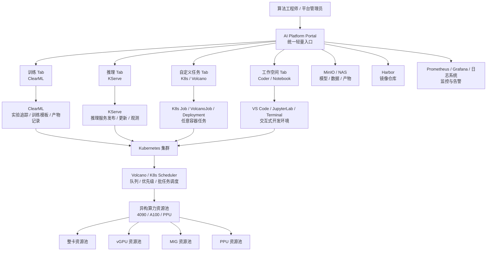

# 异构算力全自动 MLOps 平台建设方案（汇报版）

> 面向老板汇报版本。本文只说明建设背景、核心痛点、总体架构、模块边界、开发节点、资源需求和里程碑。  
> 详细技术设计、资源语义、组件部署和参数规范请见《异构算力全自动 MLOps 平台技术设计方案》。  
> 调研基准时间：2026-07-01。

---

## 1. 建设背景

随着大模型训练、微调、量化、蒸馏、剪枝、强化学习和推理服务发布需求增加，算法团队对 GPU/PPU 算力的使用方式已经从“单机手工跑脚本”演进为“多用户、多任务、多模型、多环境、多服务”的平台化需求。

当前团队已有自建 GPU 资源，包括 4090、A100、PPU 等异构算力。未来算力规模可能继续扩展到 20+ GPU 机器。如果仍然依赖人工登录机器、手动下载模型、手写 Kubernetes YAML、手动分配 GPU 和手动发布推理服务，平台维护成本和算法使用成本都会持续上升。

因此，建议建设一套轻量 MLOps 算力平台，目标是让算法工程师主要通过页面填参数完成训练、推理、自定义任务和交互式开发，同时让平台侧统一管理资源、队列、权限、日志、监控、数据和模型产物。

---

## 2. 当前痛点

### 2.1 算力使用痛点

1. GPU 资源空闲和排队同时存在，缺少统一调度和资源视图。
2. 4090、A100、PPU 等异构设备使用方式不统一，管理复杂。
3. 小任务独占整卡导致浪费，大任务又容易抢不到连续资源。
4. 多卡训练、分布式任务、长时间任务缺少稳定排队和优先级机制。

### 2.2 算法研发痛点

1. 算法同学需要频繁登录机器、配置环境、下载模型、准备数据。
2. 训练、微调、量化、蒸馏等流程重复，但缺少标准模板。
3. 模型文件路径、数据集路径、输出产物路径不统一，复现实验困难。
4. Python 环境、镜像、依赖版本难以复用，排查成本高。

### 2.3 推理发布痛点

1. vLLM、SGLang、TensorRT-LLM 等推理框架部署方式不统一。
2. 如果直接要求算法同学写 Kubernetes YAML，学习成本过高。
3. 推理服务缺少统一的发布、更新、回滚、日志、监控和访问入口。
4. 训练产物到推理服务之间缺少标准交付链路。

### 2.4 平台治理痛点

1. 缺少统一 Portal，训练、推理、任务、开发环境入口分散。
2. 缺少统一项目、用户、队列、配额、审计和日志规范。
3. 算力平台能力容易变成零散脚本和人工运维，后续难以扩展。

---

## 3. 建设目标

平台建设目标不是替代算法工程师的研发工作，而是把重复的基础设施工作平台化。

目标用户体验：

```text
选模型
选数据
填参数
选 GPU/PPU 规格
提交任务
查看日志和指标
保存模型产物
一键发布推理服务
```

平台侧目标：

```text
统一入口
统一资源队列
统一训练模板
统一推理发布
统一模型与数据路径
统一日志监控
统一权限审计
统一成本和资源治理
```

建议不直接建设完整 Kubeflow 全家桶，而是采用“轻量 Portal + 成熟开源组件”的组合方式，降低学习成本和落地风险。

---

## 4. 总体架构方案

### 4.1 总体架构图



### 4.2 架构核心原则

1. Portal 只做统一入口和体验封装，不重复造底层系统。
2. ClearML 专注训练、实验追踪、任务模板和模型产物记录。
3. KServe 专注推理服务生命周期管理。
4. 自定义任务专注基础 K8s 能力，不与 ClearML 训练能力混淆。
5. 工作空间专注交互式开发和调试。
6. 底层统一接入 Kubernetes、Volcano、GPU/PPU Device Plugin、MinIO/NAS 和监控体系。

---

## 5. 模块功能与解决问题

| 模块 | 建设内容 | 解决问题 |
|---|---|---|
| Portal 统一入口 | 统一登录、项目、导航、资源选择、任务提交、日志入口 | 避免系统分散，降低算法同学学习成本 |
| 训练 Tab | 接入 ClearML，提供训练、微调、量化、蒸馏、评测模板 | 解决训练任务复现、参数追踪、产物管理问题 |
| 推理 Tab | 接入 KServe，封装 vLLM、SGLang、TensorRT-LLM 发布 | 解决推理服务发布不标准、YAML 成本高问题 |
| 自定义任务 Tab | 封装 K8s Job、VolcanoJob、Deployment、日志查看 | 解决临时任务、自定义镜像、自定义服务运行问题 |
| 工作空间 Tab | 接入 Coder 或 Notebook，提供 VS Code/JupyterLab/Terminal | 解决算法同学交互式开发、调试、试验环境问题 |
| 资源调度层 | Kubernetes + Volcano + GPU/PPU 插件 + 资源池隔离 | 解决多用户、多任务、多设备调度和排队问题 |
| 存储与产物层 | MinIO/NAS + ClearML Model/Dataset/Artifact | 解决模型、数据、checkpoint、评估报告统一归档问题 |
| 监控与审计层 | Prometheus、Grafana、日志、事件、用户操作记录 | 解决资源可观测、问题排查、平台治理问题 |

---

## 6. 推荐建设路径

建议按“先训练、再推理、再自定义任务、最后工作空间”的顺序推进。

```text
P0：基础设施准备
P1：训练任务平台化
P2：推理服务平台化
P3：自定义任务平台化
P4：交互式工作空间
```

选择这个顺序的原因：

1. 训练和微调是当前算法同学最高频需求，最先产生价值。
2. ClearML 学习成本相对低，适合小团队先落地。
3. 推理服务需要在训练产物规范化之后再接，链路更顺。
4. 自定义任务和工作空间属于灵活性增强能力，可以分阶段补齐。

---

## 7. 项目开发节点与里程碑

以下为建议节奏，可根据团队人力压缩或拉长。

| 阶段 | 周期 | 建设重点 | 交付物 | 验收标准 |
|---|---:|---|---|---|
| 阶段 0：基础设施梳理 | 第 1-2 周 | K8s、Volcano、GPU/PPU 资源池、MinIO/NAS、Harbor、监控 | 基础资源池和环境清单 | GPU/PPU 可被 K8s 识别，训练镜像可拉取，存储可挂载 |
| 阶段 1：训练 MVP | 第 3-6 周 | ClearML Server/Agent、训练队列、基础训练模板 | 训练任务页面入口、模板任务、日志和产物记录 | 算法同学可通过页面提交微调/量化任务并查看结果 |
| 阶段 2：Portal 训练封装 | 第 7-9 周 | Portal 训练 Tab、模板参数表单、模型/数据路径规范 | 训练模板表单、任务状态页、产物链接 | 常用训练场景不需要登录机器即可提交 |
| 阶段 3：推理 MVP | 第 10-12 周 | KServe、vLLM/SGLang 服务模板、推理日志与监控 | 推理服务发布页、服务列表、访问地址 | 训练产物可发布为在线推理服务 |
| 阶段 4：自定义任务 | 第 13-14 周 | K8s/Volcano Job、Deployment、日志、停止/删除 | 自定义任务/服务发布页 | 用户可提交任意镜像任务并查看日志 |
| 阶段 5：工作空间 | 第 15-16 周 | Coder 或 Notebook、PVC、资源配额、空闲回收 | VS Code/JupyterLab 工作空间入口 | 用户可创建交互式开发环境并复用存储 |

建议第一阶段目标控制在 6 周左右，先把“训练任务不登录机器”跑通，避免一开始铺太大。

---

## 8. 人力与资源需求

### 8.1 人力需求

| 角色 | 建议投入 | 主要职责 |
|---|---:|---|
| 平台/后端工程师 | 1-2 人 | Portal 后端、任务编排、组件集成、接口开发 |
| 前端工程师 | 1 人 | Portal 页面、表单、任务列表、日志和状态展示 |
| K8s/运维工程师 | 1 人 | K8s、Volcano、GPU 插件、存储、监控、网络 |
| 算法代表 | 0.5 人 | 梳理训练模板、验证算法使用流程、反馈体验 |
| 测试/平台联调 | 0.5 人 | 场景验收、稳定性验证、文档沉淀 |

MVP 阶段最低建议 3 人左右投入：平台后端/运维 1-2 人、前端 1 人、算法代表兼职参与。

### 8.2 基础设施需求

基础设施建议分为“最低可用”和“推荐生产”两档。GPU/PPU 机器作为算力 Worker 节点接入平台，Harbor、Kubernetes 控制面、ClearML、Prometheus、Grafana、Portal 等基础服务建议尽量部署在独立的非 GPU 管理节点上，避免占用训练机器资源。

#### 8.2.1 MVP 最低可用配置

适用于第一阶段快速落地训练平台，目标是 4-6 周内先跑通。

| 机器类型 | 数量 | 建议配置 | 主要用途 |
|---|---:|---|---|
| 管理/基础服务节点 | 3 台 | 16C / 64GB 内存 / 1-2TB NVMe SSD / 10GbE | K8s 控制面、Volcano、ClearML、Portal、Harbor、Prometheus、Grafana、日志组件 |
| GPU/PPU Worker 节点 | 现有机器 | 按现有 4090、A100、PPU 机器接入 | 训练、微调、量化、推理、自定义任务 |
| 共享存储 | 1 套 | NAS 或 MinIO，建议 20-50TB 可用容量起步 | 模型、数据集、checkpoint、adapter、量化产物、评估报告 |

这档方案机器数量少，适合 MVP，但基础服务和控制面会混部在 3 台管理节点上，后续需要根据负载拆分。

#### 8.2.2 推荐生产配置

适用于正式上线给算法团队长期使用。

| 机器类型 | 数量 | 建议配置 | 主要用途 |
|---|---:|---|---|
| K8s 控制面节点 | 3 台 | 8-16C / 32-64GB 内存 / 500GB-1TB 企业级 SSD | Kubernetes API Server、etcd、调度控制面 |
| 平台基础服务节点 | 2 台 | 16-32C / 64-128GB 内存 / 2-4TB NVMe SSD | ClearML、Portal、Harbor、Prometheus、Grafana、日志、KServe 控制组件 |
| GPU/PPU Worker 节点 | 现有机器 | 4090、A100、PPU 节点按资源池接入 | 训练、推理、自定义任务、工作空间 |
| 共享存储 | 1 套 | NAS 或分布式 MinIO，建议 50TB+ 可用容量 | 模型、数据、产物统一存储 |

也就是说，除现有 GPU/PPU 机器外，正式环境建议额外准备 **5 台非 GPU 服务器 + 1 套共享存储**。

#### 8.2.3 未来扩容到 20+ GPU 机器

如果后续扩展到 20+ GPU 机器，建议提前预留：

| 类型 | 建议 |
|---|---|
| 控制面 | 3 台控制面节点保持独立，配置提升到 16C / 64GB |
| 基础服务 | 平台基础服务节点扩到 3 台，配置 32C / 128GB / 4TB NVMe |
| 存储 | 模型和数据存储提升到 100TB+ 可用容量，并规划冷热分层 |
| 网络 | GPU 节点和存储之间建议至少 10GbE，多机训练场景建议 25GbE 或更高 |
| 镜像仓库 | Harbor 存储建议 5-10TB，并开启镜像清理策略 |
| 监控日志 | Prometheus 指标保留 15-30 天，日志按项目设置保留周期 |

#### 8.2.4 组件与机器关系

| 组件 | 建议部署位置 |
|---|---|
| Kubernetes Control Plane / etcd | 控制面节点 |
| Volcano / GPU 插件控制组件 | 控制面或基础服务节点 |
| ClearML Server | 平台基础服务节点 |
| ClearML Agent | GPU/PPU Worker 节点或独立 Agent Deployment |
| KServe Controller | 平台基础服务节点 |
| Harbor | 平台基础服务节点，镜像数据落到独立磁盘或 NAS |
| Prometheus / Grafana | 平台基础服务节点 |
| 日志系统 | 平台基础服务节点，日志数据落到独立磁盘或存储 |
| MinIO / NAS | 独立存储节点或现有企业 NAS |
| Portal | 平台基础服务节点 |

---

## 9. 风险与控制措施

| 风险 | 表现 | 控制措施 |
|---|---|---|
| 一次性建设范围过大 | 周期长、难验收、用户迟迟用不上 | 按训练、推理、自定义任务、工作空间分阶段上线 |
| 算法同学仍然觉得复杂 | 需要理解太多底层概念 | Portal 暴露业务参数，不暴露 Kubernetes YAML |
| GPU 资源语义混乱 | 整卡、MIG、vGPU 混用导致调度异常 | 按资源池隔离，平台统一封装资源规格 |
| 模型和数据路径混乱 | 任务无法复现，推理找不到产物 | 制定统一模型、数据、产物路径规范 |
| 推理服务稳定性不足 | 服务不可用、排查困难 | KServe 标准化发布，接入日志、监控和告警 |
| 自研 Portal 维护成本 | 功能越做越重 | Portal 只做轻量壳，底层复用 ClearML/KServe/Coder 等开源组件 |

---

## 10. 预期收益

1. 算法同学减少登录机器、手写 YAML、手工配置环境的时间。
2. 训练、微调、量化、蒸馏等高频流程沉淀为模板，提高复用率。
3. 训练产物、模型版本、数据版本和评估结果可以追踪和复现。
4. 推理服务发布标准化，降低从模型到服务的交付成本。
5. GPU/PPU 资源进入统一调度和监控，提升资源利用率和治理能力。
6. 平台能力可随算力规模扩展，支撑未来 20+ GPU 机器规模。

---

## 11. 需要决策的事项

1. 是否确认采用“轻量 Portal + ClearML + KServe + K8s/Volcano + Coder/Notebook”的路线。
2. 是否确认第一阶段优先建设训练任务平台化能力。
3. 是否明确投入 3-4 人进行 6 周 MVP 建设。
4. 是否确定模型、数据、产物统一存储建设优先级。
5. 是否允许平台对 GPU/PPU 资源进行统一队列和配额管理。

---

## 12. 一句话总结

本项目建议建设一套轻量 MLOps 算力平台，用 Portal 统一封装 ClearML 训练、KServe 推理、K8s 自定义任务和交互式工作空间，让算法同学通过页面完成主要工作，让平台侧统一管理异构算力、模型数据、任务队列、日志监控和产物交付。
