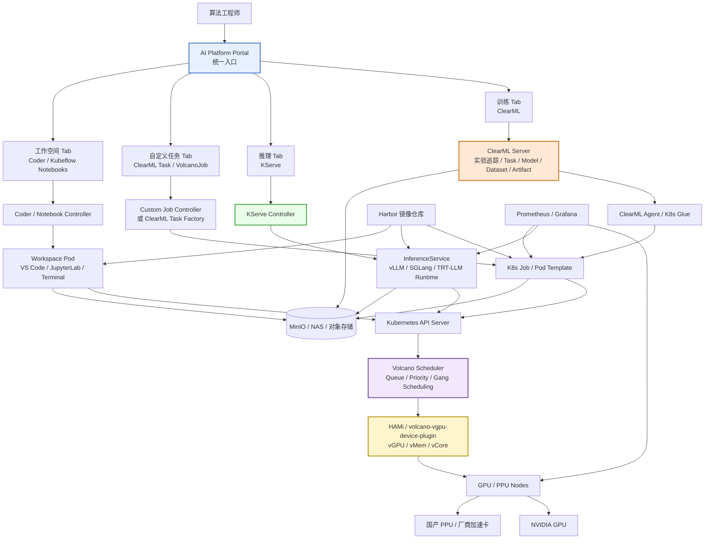
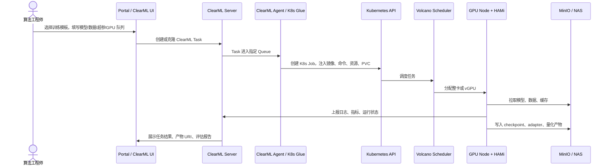
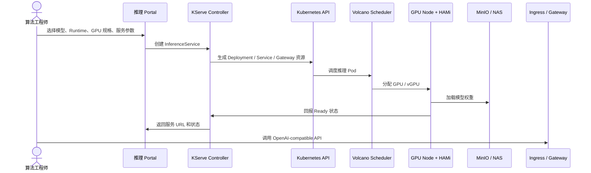
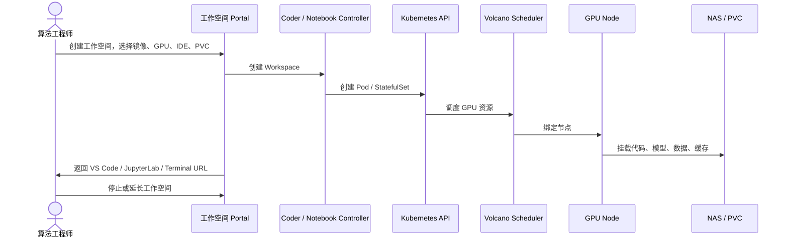
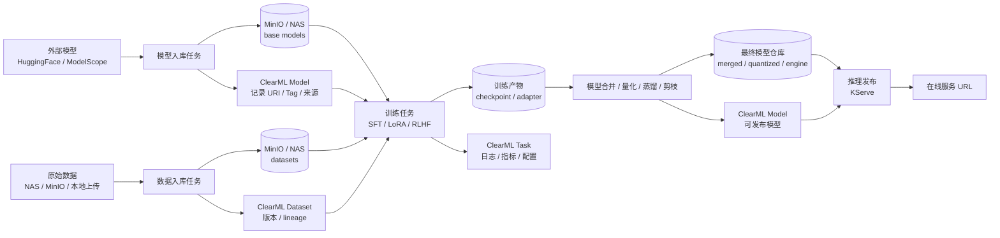

# 异构算力全自动 MLOps 平台架构方案（增强版）

> 本版本基于原《异构算力全自动 MLOps 平台架构方案》扩展，保留原有 ClearML + K8s + Volcano + HAMi 的训练调度主线，并结合近期调研结论，新增统一 Portal、KServe 推理服务、自定义任务、交互式工作空间四类能力设计。
>
> 调研基准时间：2026-07-01。

## 0. 方案结论

现阶段不建议直接上完整 Kubeflow 全家桶。对当前团队规模和使用习惯来说，更合理的路线是：

```text
整体入口：自研轻量 Portal
训练 Tab：ClearML
推理 Tab：KServe
自定义任务 Tab：ClearML Task / VolcanoJob
工作空间 Tab：Coder 或 Kubeflow Notebooks
底层调度：K8s + Volcano + HAMi / 厂商 Device Plugin
存储与缓存：MinIO / NAS / PVC
```

推荐开发优先级：

```text
P0：基础设施、存储、镜像、GPU 调度、监控
P1：训练任务能力，基于 ClearML 建设训练模板
P2：推理服务能力，基于 KServe 封装 vLLM / SGLang / TensorRT-LLM
P3：自定义任务能力，提供受控的镜像 + 命令 + GPU 运行入口
P4：交互式工作空间，接入 Coder 或 Kubeflow Notebooks
```

该方案的目标不是让算法同学直接学习 Kubernetes，而是让他们在统一平台里完成：

```text
选模型 / 选数据 / 填参数 / 选 GPU 规格 / 提交任务 / 查看日志 / 保存产物 / 发布服务
```

---

## 1. 需求痛点

原方案已识别的痛点继续成立：

1. GPU 算力使用存在空闲情况，高峰时排队明显，无法高效使用算力。

2. 拉模型速度太慢，依赖共享公司网络带宽，带宽不足。

3. 存储容量不够，开发机磁盘、训练节点磁盘容易被模型和数据打满。

4. 分布式训练跑不起来，多台 GPU 节点通信、网络带宽、NCCL 配置存在不确定性。

在近期调研和算法同学实际使用场景补充后，需要新增以下痛点：

5. 算法同学不希望频繁登录机器，不希望手动下载模型、拷贝数据、找输出目录。

6. 除了普通训练，还存在模型微调、量化、蒸馏、剪枝、强化学习、自研训练框架等多种场景，任务形态不完全统一。

7. 需要一个自由发挥入口，允许算法同学选择镜像、环境变量、启动命令、GPU 卡型，运行自定义任务。

8. 部分探索性工作需要交互式容器环境，例如 VS Code、JupyterLab、Terminal，而不是一次性训练任务。

9. 推理服务不能再靠手写 K8s YAML，需要支持 vLLM / SGLang / TensorRT-LLM 等 LLM 推理框架的标准化发布。

---

## 2. 总体架构设计

### 2.1 增强版整体架构图



### 2.2 四类能力边界

| 能力 | 入口 | 底层资源 | 生命周期 | 主要用户场景 |
|---|---|---|---|---|
| 训练任务 | ClearML | K8s Job / Pod | 跑完退出 | 自研训练、微调、量化、蒸馏、剪枝、RLHF |
| 推理服务 | KServe | InferenceService / Deployment / Service | 长期在线 | vLLM、SGLang、TensorRT-LLM、Triton |
| 自定义任务 | ClearML Task / VolcanoJob | K8s Job / VolcanoJob | 跑完退出 | 临时脚本、数据处理、自定义镜像实验 |
| 工作空间 | Coder / Kubeflow Notebooks | Pod / StatefulSet / Notebook CR | 人工使用，空闲释放 | VS Code、JupyterLab、Terminal、交互式调试 |

核心原则：

```text
KServe 只做推理服务。
ClearML 做训练实验和任务追踪。
自定义任务做受控的一次性容器运行。
工作空间做交互式开发环境。
Portal 只做用户体验层，不替代底层系统。
```

---

## 3. 原有训练调度主线保留

### 3.1 用户层：ClearML

原方案中 ClearML 的定位继续保留：

- **实验追踪**：记录代码版本、超参、Loss 曲线、日志、指标、运行状态。
- **任务执行入口**：算法工程师通过 ClearML UI clone 任务、修改参数、enqueue 到指定队列。
- **模型与产物追踪**：训练输出、量化产物、评测报告、模型 URI 均挂到 ClearML Task / Model / Artifact。
- **K8s Glue**：监听 ClearML 队列，将任务转成 K8s Job，并注入对应 Pod Template。

### 3.2 编排层：ClearML Agent / K8s Glue

ClearML Kubernetes Glue 的职责是：

```text
监听 ClearML Queue
拉取 Task 代码、参数、镜像、环境要求
根据队列映射资源规格
生成 Kubernetes Job / Pod
将日志和任务状态回写 ClearML
```

建议建设以下队列：

| 队列 | 用途 | 资源建议 |
|---|---|---|
| `cpu-data` | 数据处理、轻量预处理 | CPU + Memory |
| `gpu-4090-1` | 单卡 4090 训练 / 微调 | 1 张整卡 |
| `gpu-4090-2` | 单机双卡实验 | 2 张整卡 |
| `gpu-a100-1` | A100 单卡高优训练 | 1 张 A100 |
| `gpu-a100-multi` | 多卡 / 分布式训练 | Volcano gang scheduling |
| `vgpu-8g` | 小模型调试、轻量量化 | HAMi vGPU |
| `vgpu-18g` | 中小模型调试、推理测试 | HAMi vGPU |
| `ppu-low` | PPU 捡漏任务 | 厂商资源名 / Koordinator |

### 3.3 调度层：Volcano

Volcano 继续作为 AI 任务调度入口：

- **Queue**：按团队、项目、优先级隔离资源。
- **Gang Scheduling**：防止分布式训练部分 Pod 抢到资源后互相等待。
- **Priority / Preemption**：生产推理、关键训练任务优先，实验任务低优先级。
- **GPU 亲和性**：区分 4090、A100、PPU 等不同节点池。

### 3.4 算力池化层：HAMi

HAMi 继续用于 GPU 碎片化治理，尤其适合：

```text
小模型 LoRA / QLoRA 调试
embedding / rerank 类模型
轻量量化
推理服务测试
多人并发调试
```

不建议优先用于：

```text
大模型全参训练
多节点 DeepSpeed / FSDP
强 NCCL 通信场景
RLHF 高并发 rollout
强 SLA 线上推理
```

这些场景优先使用整卡或 MIG。

---

## 4. Portal 统一入口设计

### 4.1 Portal 不直接替代 ClearML / KServe

Portal 的定位是轻量用户体验层：

```text
展示统一导航
封装常用表单
调用 ClearML API 创建训练任务
调用 KServe / Kubernetes API 创建推理服务
展示服务状态、日志、URL、资源使用
提供权限和配额约束
```

Portal 不建议一开始做成完整 PaaS。第一阶段应尽量复用：

```text
训练详情：跳转 ClearML Task 页面
推理资源：调用 KServe InferenceService
工作空间：调用 Coder / Notebook UI
监控：跳转 Grafana
```

### 4.2 Portal 页面结构

```text
AI Platform Portal
├── 首页 Dashboard
│   ├── GPU 使用率
│   ├── 当前排队任务
│   ├── 运行中推理服务
│   ├── 我的训练任务
│   └── 我的工作空间
├── 训练
│   ├── 训练模板
│   ├── 任务列表
│   ├── 模型产物
│   └── 数据集
├── 推理
│   ├── 发布服务
│   ├── 服务列表
│   ├── 扩缩容 / 停止 / 回滚
│   └── 调用示例
├── 自定义任务
│   ├── 创建任务
│   ├── 任务历史
│   └── 日志 / 产物
└── 工作空间
    ├── 创建工作空间
    ├── 打开 VS Code / JupyterLab
    ├── 端口转发
    └── 停止 / 延长时间
```

---

## 5. 训练 Tab：ClearML 训练全场景能力

### 5.1 能力范围

ClearML 适合作为训练全生命周期底座，但不替代具体算法框架。它负责：

```text
参数管理
任务排队
远程执行
日志指标
数据和模型引用
产物归档
复现实验
任务模板
```

算法逻辑仍由具体工具实现：

| 场景 | 推荐工具 | ClearML 角色 |
|---|---|---|
| 自研训练 | PyTorch / Transformers / DeepSpeed | 记录参数、队列执行、保存 checkpoint |
| LLM 微调 | LLaMA Factory / TRL / Axolotl | 模板化参数、托管执行、归档 adapter |
| 强化学习 | verl / OpenRLHF / TRL PPO / GRPO | 编排 rollout、训练、评估 |
| 量化 | AWQ / GPTQ / bitsandbytes / llama.cpp / TensorRT-LLM | 输入模型、输出量化产物 |
| 蒸馏 | 自研脚本 / Transformers | teacher 生成数据、student 训练、评估对比 |
| 剪枝 | Wanda / SparseGPT / 自研 pruning | 输入模型、输出稀疏模型 |

### 5.2 训练模板体系

第一阶段建议沉淀以下 ClearML 模板任务：

```text
import-model-template
import-dataset-template
llm-sft-template
llm-lora-template
llm-dpo-template
llm-merge-template
llm-quantize-template
llm-distill-template
llm-eval-template
custom-python-train-template
```

算法同学的日常路径：

```text
Clone 模板 -> 填参数 -> 选择队列 -> Enqueue -> 查看日志和产物
```

Portal 稳定后，可以把上述模板包装成表单：

```yaml
base_model: /mnt/models/qwen2.5-7b
dataset: /mnt/datasets/customer_sft
method: lora
framework: llamafactory
learning_rate: 2e-5
epochs: 3
cutoff_len: 4096
queue: gpu-4090-1
output_name: qwen25-customer-lora-v1
```

### 5.3 模型路径和数据路径规范

为了避免算法同学频繁登录机器，训练参数中统一支持三类路径：

| 类型 | 参数示例 | 适用方式 |
|---|---|---|
| NAS 共享路径 | `/mnt/models/qwen2.5-7b` | 所有训练 Pod 都挂载同一路径，最简单 |
| MinIO / S3 URI | `s3://ml-models/base/qwen2.5-7b/` | 任务启动时下载到本地缓存 |
| ClearML Dataset / Model | `dataset_id` / `model_id` | 用于版本化数据和模型产物 |

训练框架最终拿到的应始终是容器内本地可访问路径，例如：

```text
/mnt/models/qwen2.5-7b
/cache/models/qwen2.5-7b
/outputs/qwen25-customer-lora-v1
```

不建议远程任务中使用开发机路径：

```text
D:\models\qwen2.5-7b
/home/user/local-models/qwen2.5-7b
```

除非任务只在该开发机本地运行。

### 5.4 训练业务流



---

## 6. 推理 Tab：KServe 推理服务发布能力

### 6.1 KServe 定位

KServe 不是推理引擎，而是推理服务控制面。它的优势是把不同推理框架统一抽象成：

```text
InferenceService
ServingRuntime / ClusterServingRuntime
Model storage URI
Service status
URL
Autoscaling / Canary / Load Balancing
```

因此推理 Tab 不应直接让算法同学写 Deployment YAML，而应让他们填写：

```yaml
service_name: qwen25-7b
runtime: vllm
model_uri: /mnt/models/qwen25-7b
gpu_profile: vgpu-18g
max_model_len: 8192
replicas: 1
route_host: qwen25-7b.internal.company.com
```

后台生成 KServe `InferenceService`。

### 6.2 推理 Runtime 规划

| Runtime | 适用场景 | 说明 |
|---|---|---|
| `vllm-runtime` | 通用 LLM 在线服务 | OpenAI-compatible API，优先落地 |
| `sglang-runtime` | Agent / 工具调用 / 高吞吐 LLM 服务 | 后续补充 |
| `tensorrt-llm-runtime` | 高性能低延迟服务 | 需要 engine 构建和硬件适配 |
| `triton-runtime` | 传统模型、TensorRT、ONNX | 非 LLM 或高性能推理 |
| `embedding-runtime` | embedding / rerank | 可独立标准化 |

第一阶段优先支持：

```text
KServe Standard InferenceService
vLLM ServingRuntime
NAS / MinIO 模型路径
固定 GPU Profile
服务 URL / 健康检查 / 日志 / metrics
```

暂不建议第一阶段上过多高级能力：

```text
复杂推理网关
多模型路由
LLM disaggregated serving
自动弹性到零
高级流量治理
```

### 6.3 推理业务流



---

## 7. 自定义任务 Tab：受控 K8s 任务入口

### 7.1 能力定位

自定义任务是给算法同学自由发挥的入口，但不是任意 K8s YAML 平台。

用户可以填写：

```yaml
image: registry.internal/llm-train-cu124:latest
command: python scripts/run_experiment.py --config configs/test.yaml
env:
  HF_HOME: /cache/huggingface
  CUDA_VISIBLE_DEVICES: "0"
gpu_profile: 1x4090
cpu: 8
memory: 64Gi
ttl: 24h
mounts:
  - /mnt/models
  - /mnt/datasets
  - /outputs
```

平台负责生成：

```text
ClearML Task
或 Kubernetes Job / VolcanoJob
```

### 7.2 ClearML Task 与 VolcanoJob 的取舍

| 方式 | 优点 | 缺点 | 建议 |
|---|---|---|---|
| ClearML Task | 有实验追踪、日志、参数、产物 | 对纯 K8s 用户略间接 | 默认优先 |
| VolcanoJob | 更贴近 K8s/HPC，适合复杂多 Pod | 需要自建日志和产物追踪 | 高级任务补充 |

第一阶段建议：

```text
自定义任务默认创建 ClearML Task。
仅在多 Pod / 特殊资源 / 训练框架要求时使用 VolcanoJob。
```

### 7.3 安全边界

自定义任务必须加限制：

```text
镜像白名单，只允许 Harbor 内部镜像
禁止 privileged
禁止任意 hostPath
限制 ServiceAccount 权限
限制可挂载 Secret
限制最大 GPU 数
限制最长运行时间 TTL
限制暴露端口
按用户/项目做 ResourceQuota
完整记录创建人、镜像、命令、环境变量、资源规格
```

---

## 8. 工作空间 Tab：交互式开发环境

### 8.1 能力定位

工作空间用于交互式调试，不用于长期在线服务。

典型需求：

```text
打开 VS Code Web
打开 JupyterLab
进入 Terminal
调试训练脚本
临时下载模型
运行 notebook
暴露临时端口
查看 GPU 状态
```

### 8.2 Coder 与 Kubeflow Notebooks 对比

| 方案 | 优点 | 缺点 | 建议 |
|---|---|---|---|
| Coder | 远程开发体验好，VS Code / SSH / 端口转发强，支持 K8s Pod 工作空间 | 不是专门 ML 平台，需要模板适配 GPU/PVC | 更适合开发工作空间 |
| Kubeflow Notebooks | 原生 AI/ML 工作台，支持 JupyterLab / VS Code / RStudio，K8s 语义清晰 | 引入 Kubeflow 生态组件，运维略重 | 若未来上 Kubeflow 子项目可考虑 |
| OpenDataHub Dashboard | Portal 产品化程度较高，有 workbench/model-serving/model-registry | 偏 OpenShift / Red Hat AI 生态，直接 fork 成本高 | 适合参考设计，不建议直接全量 fork |

当前建议：

```text
短期先不做工作空间，先完成训练和推理。
中期优先 PoC Coder。
如果后续引入 Kubeflow 子项目，再评估 Kubeflow Notebooks。
```

### 8.3 工作空间业务流



---

## 9. 模型、数据与产物业务数据流

### 9.1 统一数据流



### 9.2 模型文件路径规范

算法同学可以填写：

```text
/mnt/models/qwen2.5-7b
s3://ml-models/base/qwen2.5-7b/
clearml model id
clearml dataset id
```

平台侧需要统一处理：

```text
NAS 路径：直接传给训练脚本
S3 / MinIO URI：任务启动时下载到 /cache/models
ClearML Dataset：Dataset.get(...).get_local_copy()
ClearML Model：解析到模型 URI 或本地缓存
```

最终传给训练框架的是容器内路径：

```text
model_name_or_path: /mnt/models/qwen2.5-7b
dataset_dir: /mnt/datasets/customer_sft
output_dir: /outputs/qwen25-sft-v1
```

### 9.3 存储分层

| 存储 | 内容 | 建议 |
|---|---|---|
| NAS | 热模型、热数据、共享缓存 | 训练和推理节点统一挂载 |
| MinIO / S3 | 模型归档、数据集归档、产物归档 | 做长期存储和跨节点分发 |
| PVC | 工作空间 home、任务临时缓存 | 按用户/项目隔离 |
| ClearML Server Storage | 小型 artifact、配置、报告 | 不建议存超大模型本体 |

---

## 10. 自建 GPU 机器落地建议

原方案建议继续保留，并补充如下：

| 模块 | 建议方案 | 备注 |
|---|---|---|
| 存储 | MinIO + 高性能 NAS | 20 台机器必须共享存储，模型、数据、缓存、输出都要统一 |
| GPU 支持 | NVIDIA GPU Operator / 厂商 Device Plugin | 先让 K8s 正确识别 GPU，再接 Volcano/HAMi |
| 调度 | Volcano | 统一队列、优先级、Gang Scheduling |
| vGPU | HAMi / volcano-vgpu-device-plugin | 用于碎片化 GPU 场景，不建议滥用于强通信训练 |
| 镜像仓库 | Harbor | 内网镜像仓库，避免公网拉取和版本漂移 |
| 监控 | Prometheus + Grafana | GPU、vGPU、Pod、KServe、ClearML Agent 都要纳入监控 |
| 日志 | Loki / Elasticsearch 可选 | Portal 查看任务日志和服务日志 |
| 权限 | Keycloak / OIDC / LDAP 可选 | Portal、ClearML、KServe、Coder 统一身份更理想 |

---

## 11. 阿里 PPU 接入与管理

原方案中 PPU 部分判断继续保留：阿里 PPU 自带 device plugin，基础识别和调度问题不大，但生态较封闭，接入 HAMi 做显存/算力切分存在不确定性。

建议策略：

### 11.1 短期：保留厂商原生底座

```text
ACK / Koordinator / cGPU / 厂商 Device Plugin
+ ClearML Glue
+ Portal 资源队列映射
```

在 ClearML Glue 的 Pod Template 中，将资源请求从 NVIDIA 资源名映射到厂商资源名：

```yaml
resources:
  limits:
    aliyun.com/gpu-mem: "..."
    aliyun.com/gpu-core: "..."
```

该方式优先解决：

```text
ClearML 训练任务能调度到 PPU
PPU 空闲资源能被低优任务利用
业务推理优先，实验任务捡漏
```

### 11.2 中长期：评估 Volcano + HAMi 统一调度

如果希望完全统一 GPU / PPU 的调度入口，需要验证：

```text
HAMi-core 是否能适配 PPU 的类 CUDA API
Volcano 是否能感知 PPU 拓扑和高速互联
PPU 多卡训练镜像、驱动、SDK 是否能稳定容器化
PPU 资源名是否能被统一抽象为平台 ResourceProfile
```

该方向属于研发型投入，不建议作为第一阶段主路径。

---

## 12. 开源方案复用与 Fork 建议

| 项目 | 可复用位置 | 结论 |
|---|---|---|
| ClearML | 训练实验、任务模板、远程执行、产物追踪 | 作为训练 Tab 底座 |
| KServe | 推理服务控制面 | 作为推理 Tab 底座 |
| KServe Models Web App | KServe UI 参考 | 可参考，不建议直接作为最终 Portal |
| OpenDataHub Dashboard | Portal / Workbench / Model Serving UI 参考 | 产品化程度高，但偏 OpenShift，fork 成本较高 |
| Coder | 工作空间、VS Code、SSH、端口转发 | 中期优先 PoC |
| Kubeflow Notebooks | JupyterLab / VS Code / RStudio 工作台 | 如果引入 Kubeflow 子项目，可考虑 |
| Argo CD | GitOps 发布和回滚 | 推理服务稳定后引入 |
| Argo Workflows | 通用工作流 | 可作为高级 Pipeline 补充 |

当前建议：

```text
不要直接 fork 一个大而全平台。
先自研轻量 Portal 壳，后端分别对接 ClearML、KServe、Coder/Kubeflow Notebooks。
UI 设计可参考 OpenDataHub Dashboard。
KServe 资源管理可参考 KServe Models Web App。
```

---

## 13. 阶段性落地规划

### P0：基础设施阶段

目标：把算力、存储、镜像、监控打牢。

交付：

```text
K8s 集群
NVIDIA GPU Operator / 厂商 Device Plugin
Volcano
HAMi / volcano-vgpu-device-plugin
MinIO / NAS
Harbor
Prometheus / Grafana
基础 ResourceProfile
```

### P1：训练任务阶段

目标：算法同学可以不登录机器完成主流训练任务。

交付：

```text
ClearML Server
ClearML Agent K8s Glue
训练队列
训练镜像
模型路径规范
数据集规范
训练模板任务
微调 / 量化 / 评估模板
```

### P2：推理服务阶段

目标：算法同学可以从模型产物一键发布 vLLM 服务。

交付：

```text
KServe Standard Deployment
vLLM ServingRuntime
推理 ResourceProfile
推理服务表单
服务列表
服务 URL
日志与 metrics
停止 / 扩缩容
```

### P3：自定义任务阶段

目标：提供受控自由入口。

交付：

```text
自定义任务表单
镜像白名单
命令和环境变量配置
GPU Profile 选择
TTL
日志
产物保存
权限与审计
```

### P4：工作空间阶段

目标：提供交互式开发调试环境。

交付：

```text
Coder 或 Kubeflow Notebooks PoC
VS Code / JupyterLab
GPU 工作空间模板
PVC home
端口转发
空闲自动释放
用户配额
```

---

## 14. 风险与控制点

### 14.1 自定义任务风险

风险：

```text
用户运行任意镜像
长期占用 GPU
容器逃逸风险
误挂 hostPath
Secret 泄露
任务无产物追踪
```

控制：

```text
镜像白名单
Pod Security Admission
ResourceQuota
LimitRange
TTL Controller
ServiceAccount 最小权限
Secret 白名单
审计日志
```

### 14.2 工作空间成本风险

风险：

```text
用户开 GPU 工作空间后忘记关闭
模型和缓存占满 PVC
长期空闲占用 A100
```

控制：

```text
默认 TTL
空闲自动释放
按用户配额
GPU 工作空间审批
缓存目录限额
```

### 14.3 vGPU 使用边界

HAMi vGPU 不应被宣传成所有场景的万能方案。

适合：

```text
调试
小模型训练
轻量推理
embedding / rerank
多人共享
```

不适合：

```text
多节点通信密集训练
强 SLA 线上推理
大模型全参训练
RLHF 高并发 rollout
```

---

## 15. 最终目标体验

算法同学理想使用方式：

```text
1. 进入 Portal
2. 训练 Tab 选择微调模板
3. 填模型路径、数据路径、训练参数、GPU 规格
4. 点击运行
5. 在 ClearML 看日志、指标、产物
6. 训练完成后点击发布
7. 推理 Tab 选择 vLLM Runtime 和 GPU 规格
8. KServe 创建服务并返回 URL
9. 需要自由调试时，进入自定义任务或工作空间
```

平台工程师理想管理方式：

```text
统一资源队列
统一镜像版本
统一模型和数据路径
统一产物归档
统一监控和审计
统一用户配额
```

---

## 16. 参考资料

- ClearML Kubernetes Agent：https://clear.ml/docs/latest/docs/clearml_agent/clearml_agent_deployment_k8s/
- ClearML Data：https://clear.ml/docs/latest/docs/clearml_data/
- ClearML Models：https://clear.ml/docs/latest/docs/fundamentals/models/
- ClearML Artifacts：https://clear.ml/docs/latest/docs/fundamentals/artifacts/
- KServe LLM InferenceService：https://kserve.github.io/website/docs/getting-started/genai-first-isvc
- Kubeflow Notebooks：https://www.kubeflow.org/docs/components/notebooks/overview/
- Coder：https://github.com/coder/coder
- OpenDataHub Dashboard：https://github.com/opendatahub-io/odh-dashboard
- KServe Models Web App：https://github.com/kserve/models-web-app
